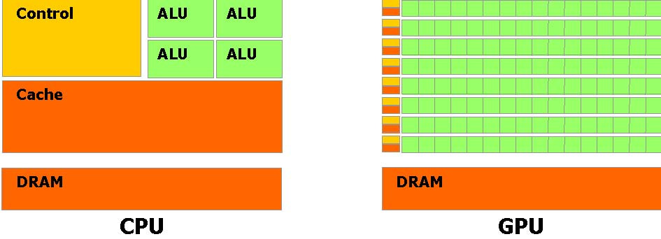
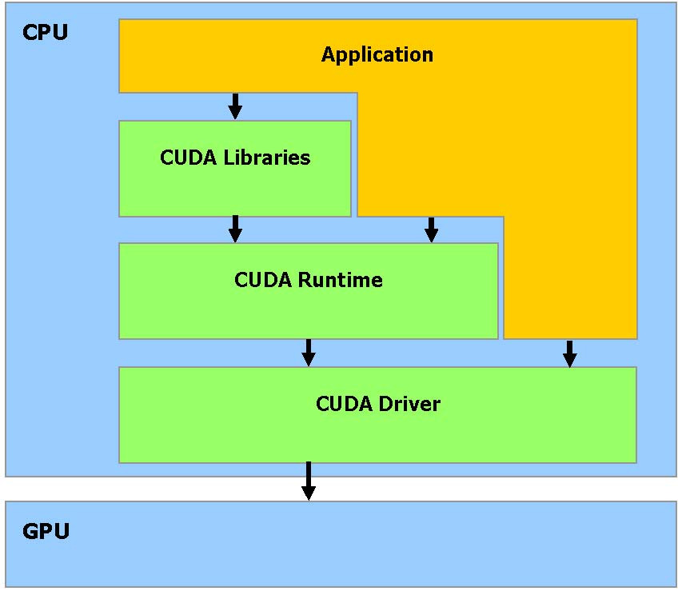
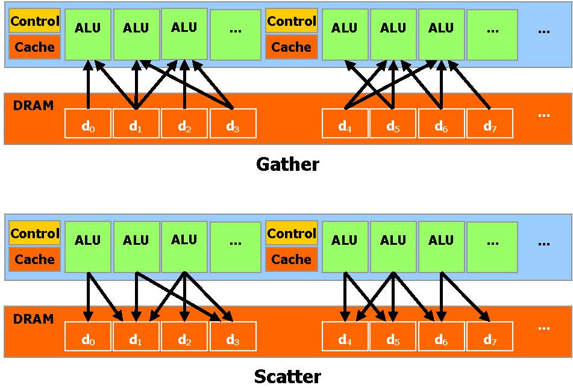
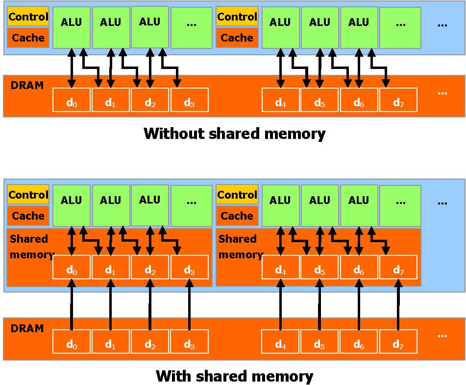
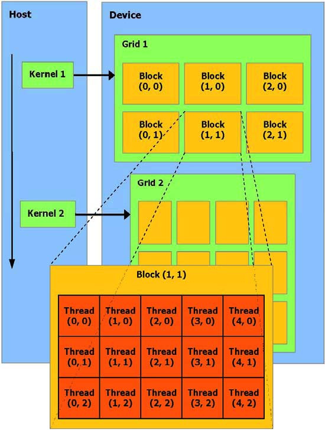
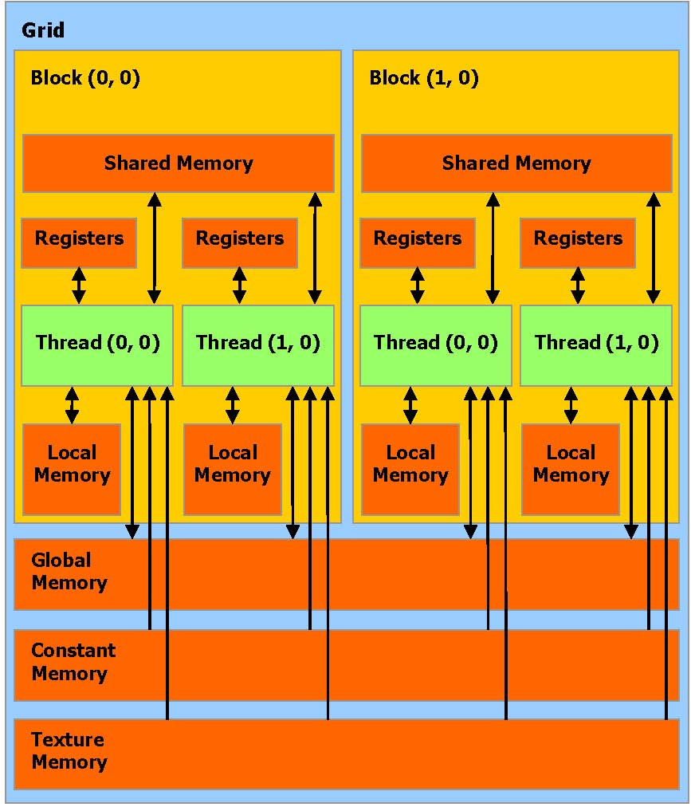
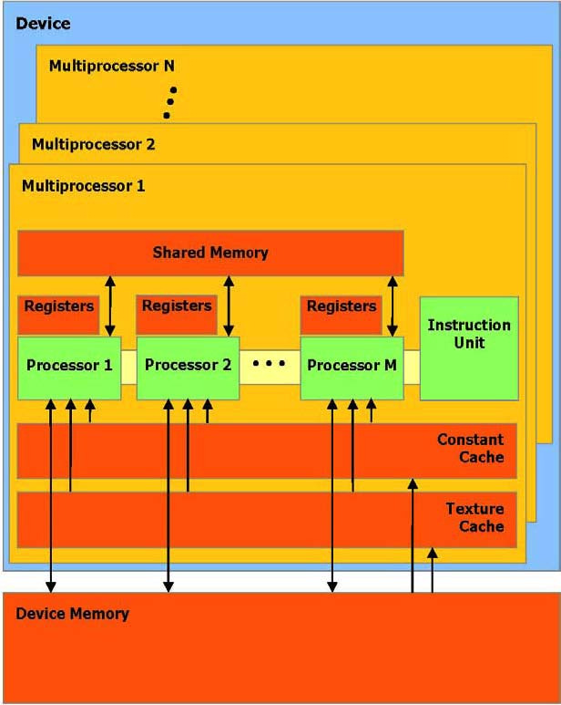

# CUDA学习笔记

## 0 目标

- 快速掌握`CUDA`编程的大致方式
- 了解`CUDA`软硬件组织架构与关系
- 了解如何查找文档

## 1 介绍

### 1.1 架构

- **CUDA (Compute Unified Device Architecture)**：统一计算设备架构，在 GPU 上发布的一个新的硬件和软件架构,它不需要映射到一个图型 API 便可在 GPU 上管理和进行并行数据计算

- **CPU、GPU架构对比**：GPU 被设计用于高密度和并行计算,更确切地说是用于图形渲染，因此更多的晶体管被投入到数据处理而不是数据缓存和流量控制

- **CUDA软件堆栈**：CUDA 软件堆栈由几层组成:一个硬件驱动程序,一个应用程序编程接口(API)和它的Runtime, 还有二个高级的通用数学库,CUFFT 和CUBLAS

- **CUDA内存操作**：CUDA 提供一般 DRAM 内存寻址方式: “ 发散 ” 和 “ 聚集 ” 内存操作，它可以在 DRAM的任何区域进行读写数据的操作

- 允许并行数据缓冲或者在 On-chip 内存共享使数据更接近ALU，可以进行快速的常规读写存取,在线程之间共享数据。应用程序可以最小化数据到 DRAM 的 overfetch 和 round-trips ,从而减少对 DRAM 内存带宽的依赖

### 1.2 编程模型

- **Kernel**：一个被执行许多次不同数据的应用程序部分,可以被分离成为一个有很多不同线程在设备上执行的函数，最终被编译成设备的指令集
- **DMA**：主机和设备使用它们自己的 DRAM ,主机内存和设备内存。并可以通过利用设备高性能直接内存存取 (`DMA`)的引擎( `API `)从一个 `DRAM` 复制数据到其他 `DRAM`

- **线程批处理**：线程批处理就是执行一个被组织成许多线程块的 `Kernel`，主机发送一个连续的 `kernel` 调用到设备。每个 `kernel `作为一个由线程块组成的批处理线程来执行
- **Block**：包含多个线程，线程间共享数据，可在`Kernel`中指定同步点，一个块里的线程被挂起直到它们所有都到达同步点，每个线程拥有`Block`内的`Thread ID`
- **Grid**：执行同一个 `Kernel` 的块可以合成为一个`Grid`，同一个`Grid`中的不同`Block`中的线程不能通讯和同步，每个`Block`有对应的`Block ID`

### 1.3 内存模型

- 线程允许访问的内存空间：
  - **读写**每条线程的`寄存器`
  -  **读写**每条线程的`本地内存`
  -  **读写**每个`Block`的`共享内存`
  -  **读写**每个`Grid`的`全局内存`
  -  **只读**每个`Grid`的`常量内存`
  -  **只读**每个`Grid`的`纹理内存`

- 

- 全局,常量,和纹理内存空间可以通过主机或者同一应用程序持续的通过 kernel 调用来完成读取或写入
- 全局,常量,和纹理内存空间对不同内存的用法加以优化。纹理内存同样提供不同的寻址模式,也为一些特殊的数据格式进行数据过滤

### 1.4 硬件实现

- **SIMD**：单指令多数据，在给定时钟周期内，多处理器的每个处理器执行同一指令，操作不同数据，并行数据缓存或共享内存,被所有处理器共享实现内存空间共享，一个`Block`只被一个多处理器处理
- **Active**：被一个多处理器执行的`Block`,被称作` active`
- **Warp**：每个`active`被划分为多个`SIMD`方式的线程组，每一组称为一个`warp`，每个`warp`大小相同，线程调度程序周期性地从一个`warp`切换到另一个`warp`

## 2 API

- C语言扩展：
  - 函数类型限定：指定函数执行的位置和调用位置
    - `__device__` : 设备上执行，仅可从设备调用
    - `__global__`: 设备上执行，仅可从主机调用
    - `__host__`: 主机上执行，仅可从主机调用
  - 变量类型限定：指定设备上变量的内存位置
    - `__device__`：驻留在设备
    - `__constant__`: 驻留在常量内存空间
    - `__shared__`: 驻留在线程块的共享内存空间中
    - 只能通过设备代码中的`__device__`, `__shared__`或`__constant__`变量来获取地址。`__device__`或`__constant__`变量的地址只能通过主机代码获得, `cudaGetSymbolAddress()`
  - 在设备上执行的方式配置、指定`Grid`和`Block`的维数，`Block`和`Thread`的ID
    - 所有` __global__ `函数的调用必须指定执行配置，执行配置定义了通常在设备执行的函数的`Grid`和`Block`的维数
    - **Dg**: `dim3`类型，指定`Grid`维数，`Dg.x * Dg.y` 等于被发送`Block`的数量
    - **Db**: `dim3`类型，指定`Block`维数，`Db.x * Db.y * Db.z` 等于每个`Block`的线程数
    - **Ns**: `size_t`类型，指定共享内存大小，可被任何外部数组变量使用，默认为0，可选参数
    - **S**: `cudaStream_t`类型，指定相关`stream`，默认为0，可选参数
    - 示例：
      - 声明：```__global__ void Func(float* parameter);```
      - 调用：```Func<<< Dg, Db, Ns >>>(parameter);```
- 内置变量：
  - **gridDim：** `dim3`类型，指定`Grid`维数
  - **blockIdx：** `uint3`类型，指定`Block ID`
  - **blockDim：** `dim3`类型，指定`Block`维数
  - **threadIdx：** `uint3`类型，指定`Thread ID`
  - 内置变量不允许取得任何地址且不允许赋值到任何内置变量
- 每个包含CUDA 语言扩展的源文件必须通过CUDA 编译器`nvcc`编译
- 
