# HugeCTR 学习笔记

## 0 目标

- 学习HugeCTR方案与设计架构
- 搭建适用于寒武纪MLU的推荐系统分布式训练框架
- 网络测试与性能优化

## 1 背景

### 1.1 推荐系统与深度学习

- 随着互联网的发展，受益于数据爆炸式地增长，用户获取信息的途径与方式越来越轻松多样，但也因为其中夹杂着大量庞杂冗余甚至无用的信息，如何提供用户真正感兴趣的内容也成为了各大企业尤其是商业领域重点关的问题。推荐系统就是从海量的数据中，根据用户偏好为其选择出可能感兴趣的内容并推送给用户
- CTR（Clicktrough  rate）也即点击率，是用于评估广告、搜索内容、博文等质量、搜索相关程度以及用户喜爱程度的重要指标，也能反馈给信息提供者所推荐给用户的内容是否合适、质量是否上乘、该内容是否选对了潜在受众。CTR的定义为内容被用户点击的次数除以内容展示给用户的次数，e.g. 一条广告被用户刷到了100次，但用户只点进去了1次，那么点击率就是1%
- 与传统推荐系统实现方式相比，深度学习推荐模型具有更强的表达能力，模型结构更加灵活能够适应不同的使用场景
- 从技术架构上，可将推荐系统分为数据与模型部分：
  - 数据部分主要负责“用户”“物品”“场景”的信息收集与处理；
  - 模型部分是推荐系统的主体，模型的结构一般由“召回层”“排序层”“补充策略与算法层”组成：
    - 召回层：一般利用高效的召回规则、算法或简单的模型,快速从海量的候选集中召回用户可能感兴趣的物品
    - 排序层：利用排序模型对初筛的候选集进行精排序
    - 补充策略与算法层：也被称为“再排序层”,可以在将推荐列表返回用户之前,为兼顾结果的“多样性”“流行度”“新鲜度”等指标,结合一些补充的策略和算法对推荐列表进行一定的调整,最终形成用户可见的推荐列表
- 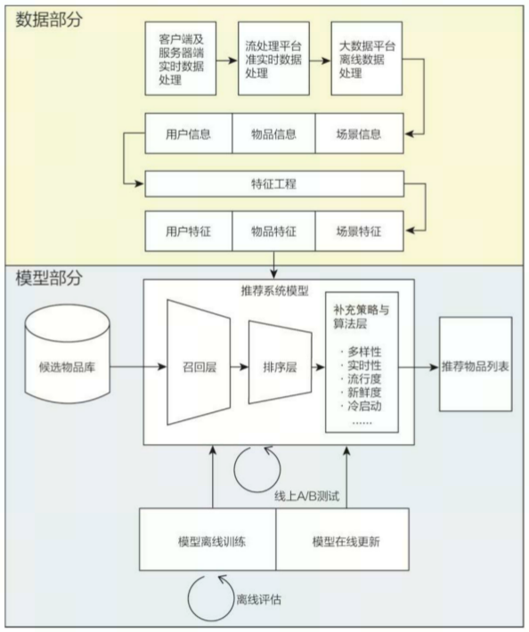

### 1.2 Merlin

- Merlin  是NVIDIA为推荐系统模型推理训练专门构建的一套端到端解决方案，包括库、方法和工具，通过解决常见的预处理、特征工程、训练、推理和部署到生产来简化推荐器的构建。Merlin 组件和功能经过优化，可支持数百 TB 数据的检索、过滤、评分和排序，所有这些都可通过易于使用的 API 访问。
- 它包括NVTabular、HugeCTR、Merlin Models、Merlin Systems、Merlin Core等组件：
  - **[NVTabular](https://github.com/NVIDIA-Merlin/NVTabular)**：NVTabular 是一个表格数据的特征工程和预处理库。该库可以快速轻松地操作用于训练基于深度学习的推荐系统的 TB 级数据集。该库提供了一个高级 API，可以定义复杂的数据转换工作流程
  - **[HugeCTR](https://github.com/NVIDIA-Merlin/HugeCTR)**：HugeCTR 是一个 GPU 加速的训练框架，可以通过跨多个 GPU 和节点分布训练来扩展大型深度学习推荐模型。 HugeCTR 包含具有 GPU 加速的优化数据加载器，并提供了将大型嵌入表扩展到可用内存之外的策略
  - **[Merlin Models](https://github.com/NVIDIA-Merlin/models)**：Merlin 模型库为推荐系统提供标准模型，旨在实现从经典机器学习模型到高度先进的深度学习模型的高质量实现
  - **[Merlin Systems](https://github.com/NVIDIA-Merlin/systems)**：Merlin Systems 提供的工具可将推荐模型与生产推荐系统的其他元素（如特征存储、最近邻搜索和探索策略）组合成端到端的推荐管道，这些管道可以通过 Triton 推理服务器提供服务
  - **[Merlin Core](https://github.com/NVIDIA-Merlin/core)**：Merlin Core 提供在整个 Merlin 生态系统中使用的功能

  - 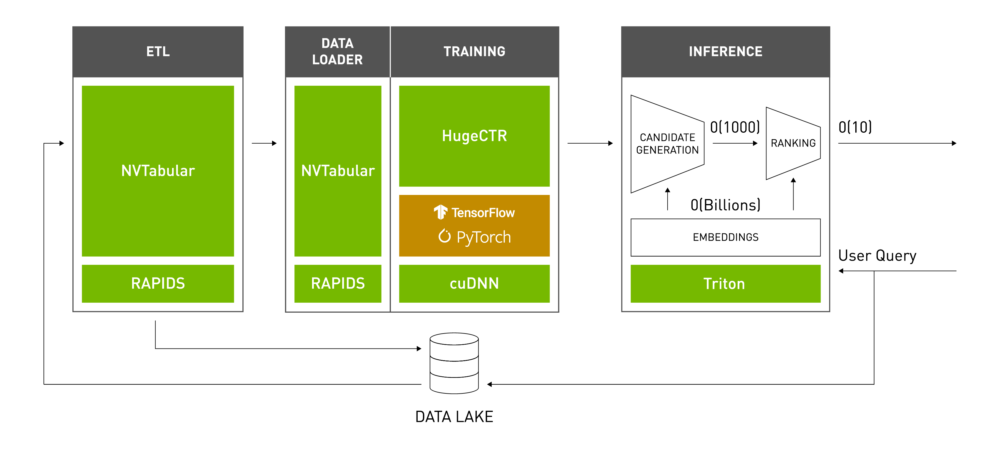
  - 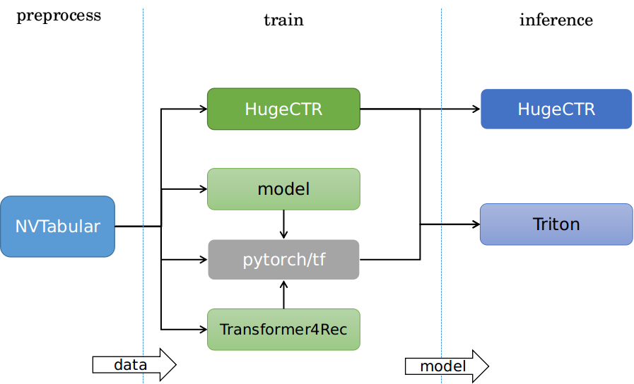

## 2 介绍

- HugeCTR是由NVIDIA发布开源的使用 CUDA C++ 编写专用于大型推荐系统模型使用GPU进行训练与推理的深度学习框架，利用了 GPU 加速库，例如[cuBLAS](https://developer.nvidia.com/cublas)、[cuDNN](https://developer.nvidia.com/cudnn)和[NCCL](https://developer.nvidia.com/nccl)，针对 NVIDIA GPU 的性能进行了高度优化，同时允许用户以 JSON 格式自定义模型

### 2.1 特性

- **速度**：单节点A100设备上可在1.7min内训练[mlperf v2.0](https://mlcommons.org/en/training-normal-20/) DLRM

- **规模**：多节点模型并行、hierarchical解决方案

- **使用**：类似Keras的 Python API

- 核心特征

  ：使用GPU内存内的哈希表实现分布式embedding、异步与多线程数据流水、hierarchical 参数服务器(HPS)做推理、Tensorflow embedding插件(SOK)

  - Sparse Operation Kit (SOK)

    :用于提供HugeCTR对稀疏模型训练的GPU加速op的python包，能在tensorflow中使用，并能兼容horovod和tensorflow的分布式策略

    - 定义模型结构: 使用 SOK 来搭建模型的时候，只需要将 TensorFlow 中的 Embedding Layer 替换为 SOK 对应的 API 即可
    - 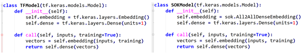
    - 使用 Horovod 来定义 training loop: 使用 SOK 时，只需要对 Embedding Variables 和 Dense  Variables 进行分别处理即可, Embedding Variables 部分由 SOK 管理，Dense Variables 由  TensorFlow 管理
    - 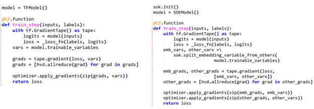
    - 使用 tf.distribute.MirroredStrategy 来定义 training loop:
    - 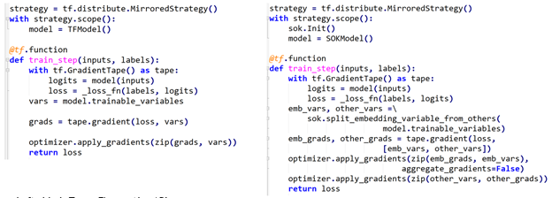
    - 开始训练过程时，使用 SOK 与使用 TensorFlow 时所用代码完全一致:
    - 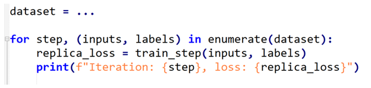


- 2019 v1.x 发布原型系统来展示网络训练加速效果
- 2020 v2.x 作为组件加入Merlin中，并获得了同年的[mlperf v0.7](https://mlcommons.org/en/training-normal-07/) DLRM 8卡测试第一
- 2021 v3.x 支持使用hierarchical 参数服务器做推理，支持作为tensorflow插件使用其embedding方法
- 2022 4.0 发布新的解耦embedding组件来支持其生态

### 2.2 性能

- HugeCTR 在

  Criteo数据集

  上20-core Intel Xeon CPU E5-2698 v4 和 V100 16GB GPU 训练

  2X1024 FC layers

  WDL

  的性能：相对Tensorflow-CPU实现了114倍加速，相对Tensorflow-GPU实现7.4倍加速

  - 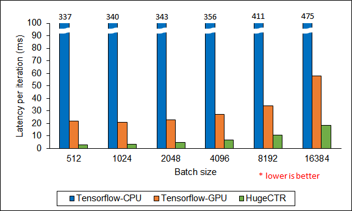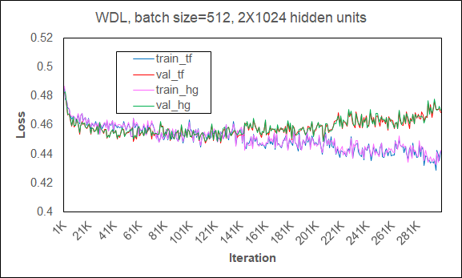
  - 在[强伸缩](https://hpc-wiki.info/hpc/Scaling)（也即问题规模不变，只有设备数量伸缩）下训练WDL的结果：
  - 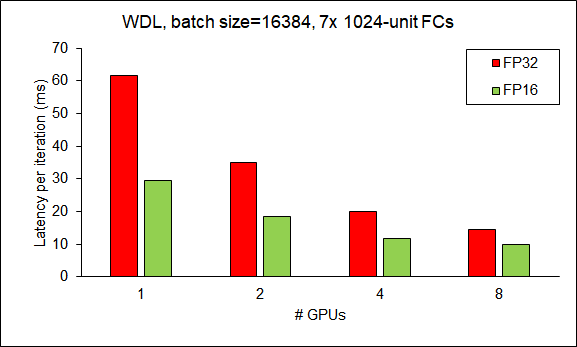

- HugeCTR 在

  Criteo数据集

  上20-core Intel Xeon CPU E5-2698 v4 和 V100 16GB GPU 训练

  2X1024 FC layers

  DCN

  的性能：相对Tensorflow-CPU实现了83倍加速，相对Tensorflow-GPU实现8.3倍加速

  - 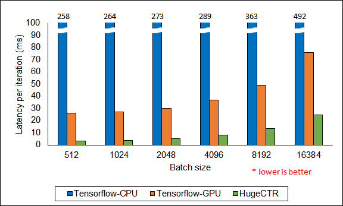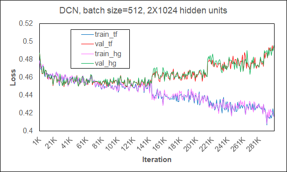
  - 在[强伸缩](https://hpc-wiki.info/hpc/Scaling)（也即问题规模不变，只有设备数量伸缩）下训练DCN的结果：
  - 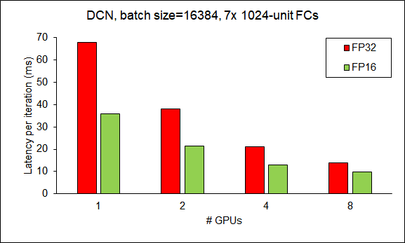

-  HugeCTR TensorFlow 在合成数据集上 NVIDIA DGX A100 80GB 上嵌入插件的性能

- 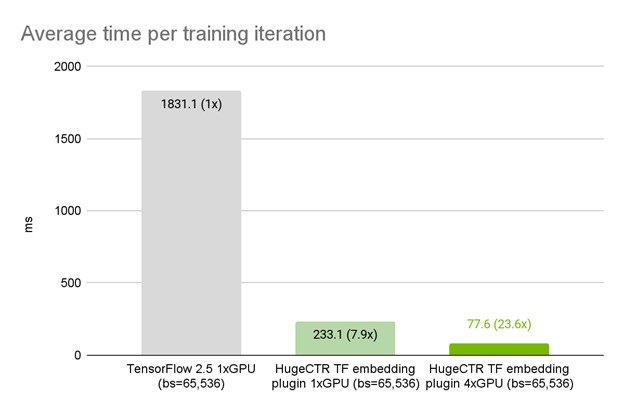

- 美团数据上 NVIDIA DGX A100 80GB 上的 HugeCTR TensorFlow 嵌入插件性能（[弱伸缩](https://hpc-wiki.info/hpc/Scaling)，也即问题规模和设备规模同时伸缩）

- 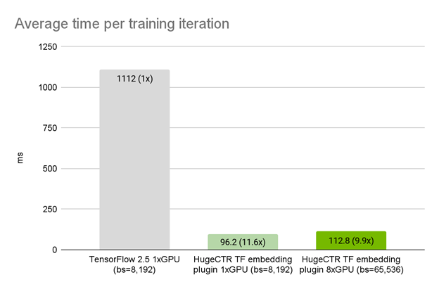

- 使用 MLPerf 的标准模型 DLRM 来对 SOK 的性能进行测试,相比于 NVIDIA 的 DeepLearning Examples，使用 SOK 可以获得更快的训练速度以及更高的吞吐量

- 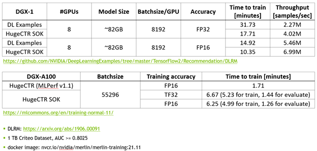

- Criteo数据集1下对使用Pytorch 训练DLR做对比：

- 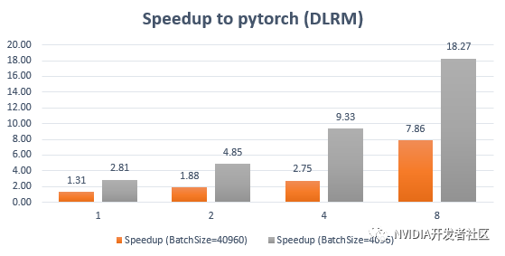

### 2.3 架构

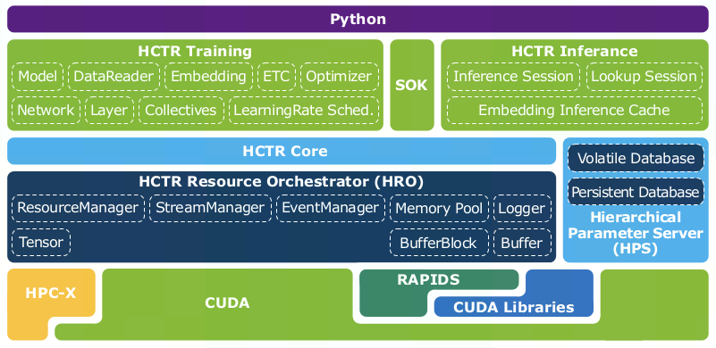

- 基于GPU的参数服务器

  ：

  - 用于加载和管理嵌入表，对于超过 GPU 显存的嵌入表，参数服务器将嵌入表存储在 CPU 内存上。对于每个子数据集，将加载所需的嵌入向量并执行多个批量更新。之后，在参数服务器中同步模型参数。

  - 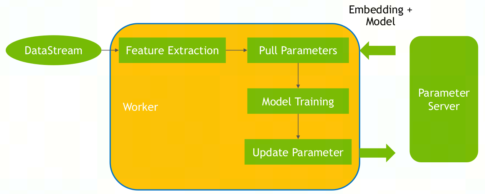

  - Hierarchical Parameter Server (HPS)

    : 用于解除推理时巨大的embedding受GPU内存限制。使用三级分层缓存，利用GPU GDDR 或高带宽内存（HBM）、分布式CPU内存以及本地SSD存储，按照数据的使用频率，存储等级由低到高为SSD→ CPU内存→ GPU内存。

    - **Embedding inference cache (level 1)**：使用GPU内存，动态缓存，优化的查询和操作运算符，以及动态插入和异步刷新机制，从而在在线推理期间保持高缓存命中率
    - **Volatile database (VDB; level 2)**：使用CPU内存，当未命中GPU中参数时，在其中查询。相对于GPU内存扩展成本更低
    - **Persistent database (PDB; level 3)**：使用SSD，保存所有模型参数，能够高效地存储展示长尾分布（指大量特征的embedding总和占据了整个模型的大部分，但是他们出现的频率非常低，因此将这种特征存储在CPU和GPU中是低效的）
    - 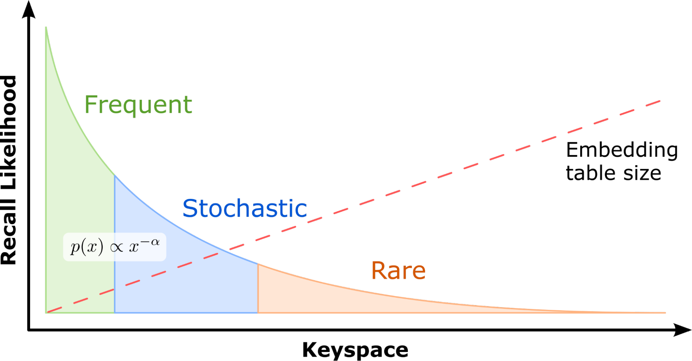

  - 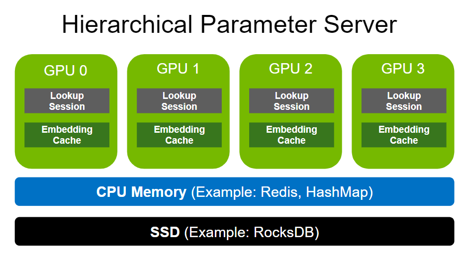

- CTR估计的DL模型

   (a)：

  - 分批读取包含高维、极其稀疏特征的数据
  - 使用Embedding层压缩输入特征到低维、稠密的嵌入向量
  - 使用前馈神经网络估计点击率
  - 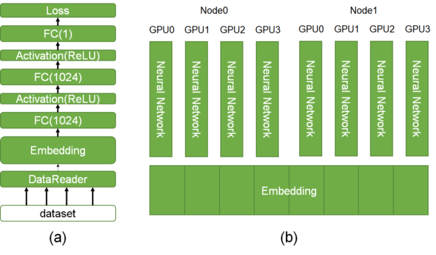


- HugeCTR模型

  （基于CTR DL模型）(b)：

  - HugeCTR 利用数据和模型并行来扩展训练，并将一个嵌入表分布于多个 GPU 之上：

    - 数据并行(前馈神经网络，适用于当前流行的WDL、DCN、DeepFM、DLRM等)

      ：

      - 推荐系统Framework都比较浅，只有三五层，有非常大的embedding，可达TB级的数据量，因此基于普通的数据并行无法很好的处理

    - 模型并行(embedding层)

      ：

      - **Embedding Training Cache (ETC)**：支持在单台设备上训练深度学习推荐系统，即使嵌入表超出 GPU  显存也支持单个节点训练TB级模型，将模型embedding放在SSD中，训练时读取一个pass放入GPU中训练，再在参数服务器中更新模型；ETC 将部分冷模型存储在外存（MOS），有利于在单台设备（如 DGX A100）上训练 TB 级嵌入表
      - **GPU内存中的哈希表**：若将embedding分布到多个GPU上，则对内存、带宽以及GPU数量有较高的要求，会带来很大的通信开销。而HugeCTR使用GPU内基于[RAPIDS cuDF](https://github.com/rapidsai/cudf)实现的哈希表来，结合NCCL作为GPU通信原语，实现跨越同构计算集群的多卡多节点模型并行嵌入表
      - 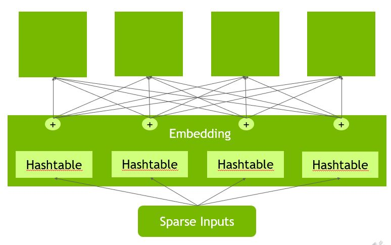

    - SOK训练的数据并行(DP)-模型并行(MP)-数据并行(DP)流程：

      - 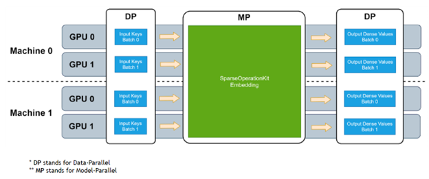
      - 输入调度(DP→ MP)
        -  将数据并行地输入，按照其求余 GPU 数量的结果，分配到了不同对应的 GPU 上，完成了 input key 从数据并行到模型并行的转化。虽然用户往每个 GPU  上输入的都可以是 embedding table 里的任何一个 key，但是经过上述的转化过程后，每个 GPU 上则只需要处理  embedding table 里 1/GPU_NUMBER 的 lookup
        -  Eg.
      - 查表(Lookup)
        - 使用输入调度输出的key在本地嵌入表中查询对应的嵌入向量
        -  Eg.
      - 输出调度(MP→ DP)
        - 将 embedding vector 按照和 input dispatcher 相同的路径、相反的方向将 embedding vector 返回给各个 GPU，让模型并行的 lookup 结果重新变成数据并行
        -  Eg.
      - Backword:
        - 与前向的工作流程和路径相同，需要做GPU之间的梯度交换，只是数据回传更新梯度的方向与前向相反

  - 为了防止数据加载成为训练中的主要瓶颈，它实现了一个专用的异步和多线程的数据读取器

    -  使用多线程数据读取器隐藏数据获取延时，worker用于并行读取一批训练数据，collector用于分发数据到多卡，worker、collector、model training都在不同的线程中运行
    - 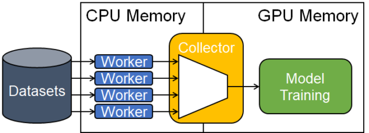
    - 除了多线程读取数据，还使用流水线来将不同batch的数据读取、分发与训练堆叠起来，进一步缩短数据加载耗时
    - 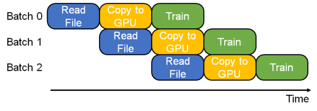

  - 嵌入阶段使用 GPU 加速，包括表查找、每个slot内的权重规约以及跨slot的权重拼接

    - 嵌入表可以分割成多个slot（或特征field，也即同一个关联特征的集合）。在嵌入查找过程中，属于同一个slot的输入稀疏特征在独立转换为相应的密集嵌入向量后，被规约为单个嵌入向量。之后，不同slot的嵌入向量将拼接在一起（all-to-all）

    - HugeCTR支持三种embedding方式：

      - **Localized slot embedding hash**：所有属于同一slot的embedding存储在同一个GPU中，适用于单个slot恰好能存入GPU内存的情况，slot规约时无需做GPU间通信

      - **Distributed slot embedding hash**：所有特征都分布式存储在不同GPU中，适用于单个slot embedding大于GPU内存的情况，但也因此需要更多的GPU间通信

      - Hybrid sparse embedding

        ：实现工业级性能推荐系统训练的关键技术，结合了数据与模型并行。

        - **数据并行**：前向反向传播时，本地缓存用于加速高频embedding避免了GPU间通信
        - **模型并行**：对于低频embedding，利用所有可用的GPU内存实现负载均衡存储embedding

    - 多slot嵌入机制能够提高GPU间带宽利用率：

      - 当数据集中有很多特征时，它有助于将每个槽中有效特征的数量减少到可管理的程度
      - 通过拼接不同插槽的输出，它减少了 GPU 之间的事务数量，从而促进了更高效的通信

    - 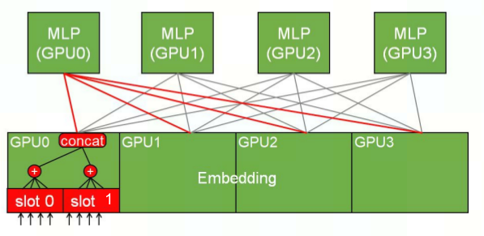

  - 所有前向反向层、优化器、loss函数都由CUDA C++实现，以高效利用CUDA优化

## 3 使用HugeCTR python API

### 3.1 安装

#### 3.1.1 使用NGC容器

```
# 可根据需要挂载文件路径
# 此容器直接使用hugectr框架训练推理，未安装tensorflow等其他框架
docker run --name="zxz-hugectr" -v /home/zhongxinzhu:/home/zhongxinzhu -v /projs/platform/zhongxinzhu:/projs/platform/zhongxinzhu -v /data:/data -v /usr/bin/nvidia-smi:/usr/bin/nvidia-smi --shm-size '64gb' --gpus all -it -p 8888:8888 -p 8797:8787 -p 8796:8786 --ipc=host --cap-add SYS_NICE nvcr.io/nvidia/merlin/merlin-hugectr:nightly /bin/bash
```

#### 3.1.2 使用源码

TODO

## 4 使用HugeCTR Sparse Operation Kit (SOK)

### 4.1 安装

TODO: 使用pip和源码安装报错FileNotFoundError: Could not find [libsparse_operation_kit_compat_ops.so](http://libsparse_operation_kit_compat_ops.so) ，排查是否是容器问题

#### 4.1.1 使用NGC容器

```
# 容器中已安装SOK
docker run nvcr.io/nvidia/merlin/merlin-tensorflow-training:22.04
```

#### 4.1.2 使用pip

```
pip install sparse_operation_kit
```

#### 4.1.3 使用源码

```
git clone https://github.com/NVIDIA-Merlin/HugeCTR.git
python setup.py install
python -c "import sparse_operation_kit as sok"
```


# **参考资料：**

## **项目**：

 [NVIDIA-Merlin/HugeCTR](https://github.com/NVIDIA-Merlin/HugeCTR) 

[NVIDIA-Merlin/Merlin](https://github.com/NVIDIA-Merlin/Merlin)

[Merlin HugeCTR Containers](https://catalog.ngc.nvidia.com/orgs/nvidia/teams/merlin/containers/merlin-hugectr)

## **文档 & paper**：

[Merlin HugeCTR‘s documentation ](https://nvidia-merlin.github.io/HugeCTR/master/index.html)

[Merlin HugeCTR: GPU-accelerated Recommender System Training and Inference](https://dl.acm.org/doi/abs/10.1145/3523227.3547405)

[SparseOperationKit’s documentation](https://nvidia-merlin.github.io/HugeCTR/sparse_operation_kit/master/index.html)

## **blogs**：

[HugeCTR源码阅读](https://blog.csdn.net/weixin_42717258/article/details/115643706)

[[源码解析\] NVIDIA HugeCTR，GPU版本参数服务器](https://www.cnblogs.com/rossiXYZ/p/15897877.html)

[扩展和加速大型深度学习推荐系统 – HugeCTR 系列第 1 部分](https://developer.nvidia.com/zh-cn/blog/scaling-and-accelerating-large-deep-learning-recommender-systems-hugectr-series-part-1/)

[使用 Merlin HugeCTR 的 Python API 训练大型深度学习推荐模型 – HugeCTR 系列第 2 部分](https://developer.nvidia.com/zh-cn/blog/training-large-deep-learning-recommender-models-with-merlin-hugectrs-python-apis-hugectr-series-part2/)

[使用 Merlin 分层参数服务器扩展推荐系统推理](https://developer.nvidia.com/zh-cn/blog/scaling-recommendation-system-inference-with-merlin-hierarchical-parameter-server/)

[Merlin HugeCTR Sparse Operation Kit 系列之一](https://developer.nvidia.com/zh-cn/blog/merlin-hugectr-sparse-operation-kit-part-1/)

[Merlin HugeCTR Sparse Operation Kit 系列之二](https://developer.nvidia.com/zh-cn/blog/merlin-hugectr-sparse-operation-kit-series-2/)

[Merlin HugeCTR 分级参数服务器简介](https://developer.nvidia.com/zh-cn/blog/merlin-hugectr-hierarchical-parameter-server-intro/)

[Merlin HugeCTR 分级参数服务器系列之二](https://developer.nvidia.com/zh-cn/blog/merlin-hugectr-hierarchical-parameter-server-part2/)

[Introducing NVIDIA Merlin HugeCTR: A Training Framework Dedicated to Recommender Systems](https://developer.nvidia.com/blog/introducing-merlin-hugectr-training-framework-dedicated-to-recommender-systems/)

[Using Neural Networks for Your Recommender System](https://developer.nvidia.com/blog/using-neural-networks-for-your-recommender-system/)

[从算法到工程，推荐系统全面总结](https://www.infoq.cn/article/qeawcijqfrycqpueaqs4)

[嵌入(embedding)层的理解](https://www.cnblogs.com/USTC-ZCC/p/11068791.html)

[【项目】搜索广告CTR预估](https://www.cnblogs.com/futurehau/p/6181008.html)