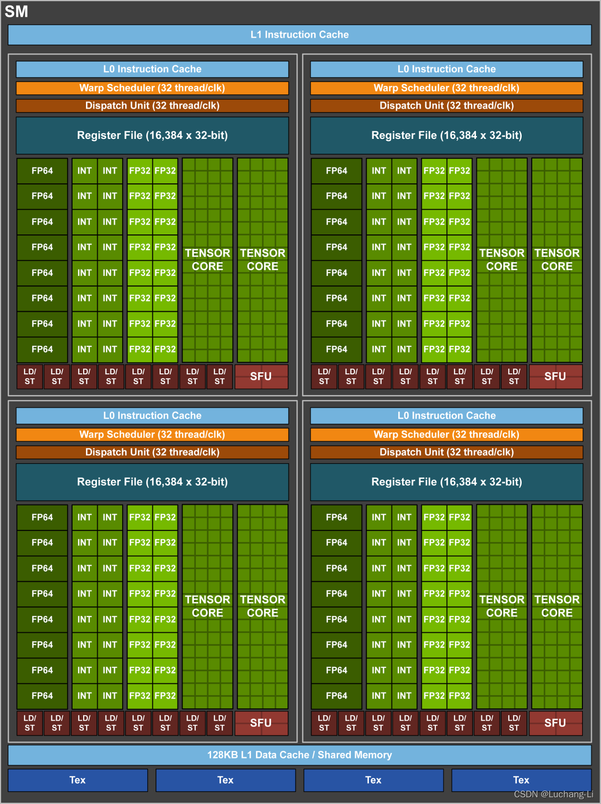
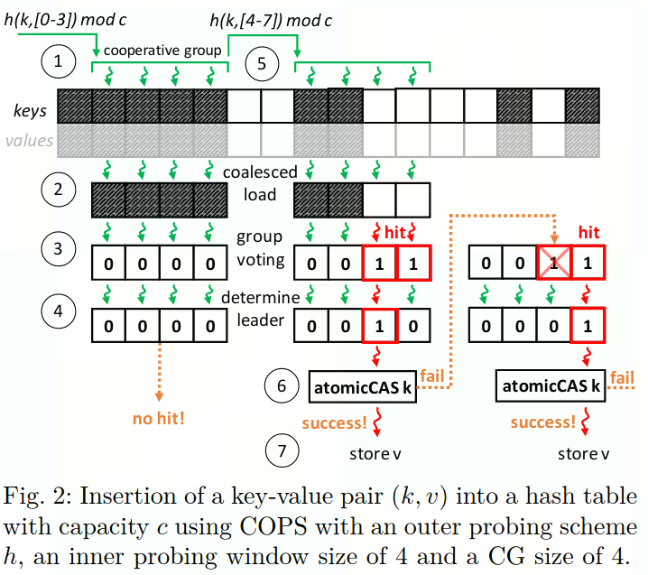
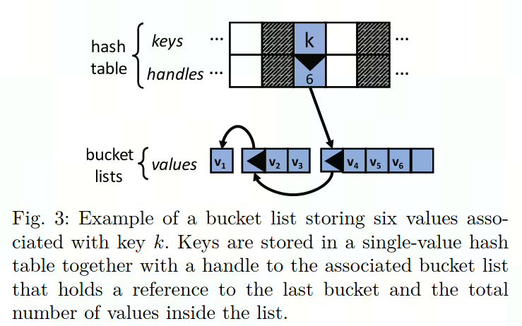
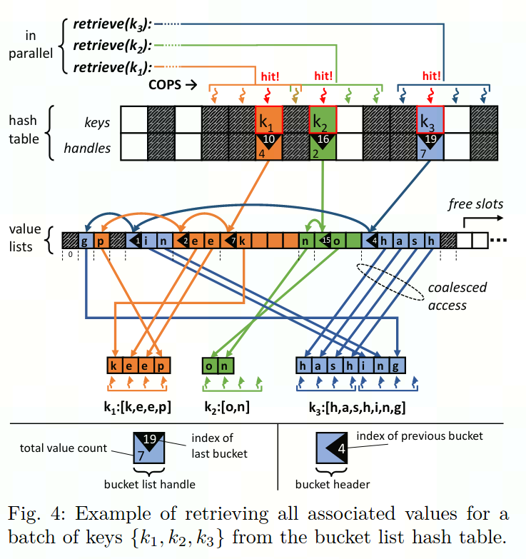
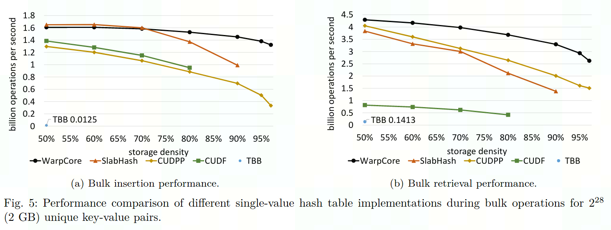
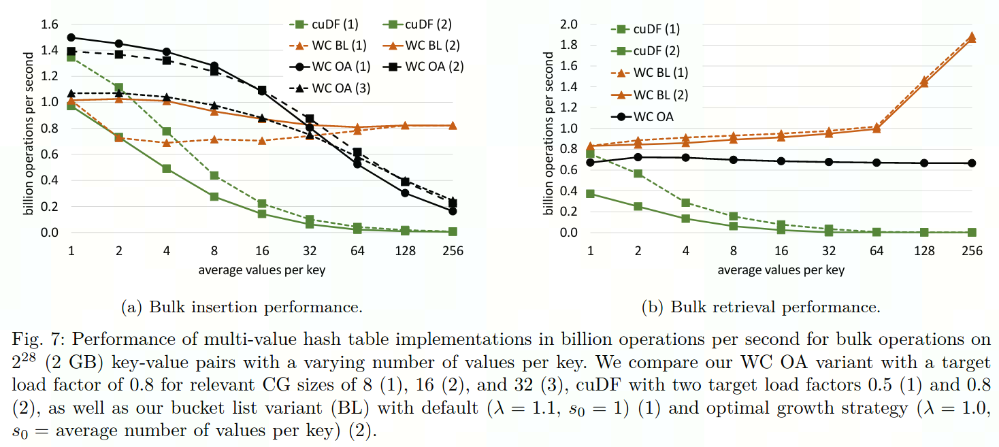

# WARPCORE 学习笔记

项目链接：[https://github.com/sleeepyjack/warpcore](https://github.com/sleeepyjack/warpcore)

文档：[https://sleeepyjack.github.io/warpcore/index.html](https://sleeepyjack.github.io/warpcore/index.html)

文献：[https://arxiv.org/abs/2009.07914](https://arxiv.org/abs/2009.07914)

参考：[https://docs.nvidia.com/cuda/cuda-c-programming-guide/index.html](https://docs.nvidia.com/cuda/cuda-c-programming-guide/index.html)

## 1 背景

### 1.1 简介

- warpcore 是用于快速在 CUDA 加速器上创建高吞吐量、专门构建散列数据结构的框架
- 该项目仍在不断开发中，将来或有重大更新与重构

### 1.2 数据结构

- [`HashSet`](https://github.com/sleeepyjack/warpcore/blob/master/include/warpcore/hash_set.cuh): 存储键，每个键仅出现一次
- [`SingleValueHashTable`](https://github.com/sleeepyjack/warpcore/blob/master/include/warpcore/single_value_hash_table.cuh): 存储单个键值对，每个键仅出现一次
- [`MultiValueHashTable`](https://github.com/sleeepyjack/warpcore/blob/master/include/warpcore/multi_value_hash_table.cuh): 存储多组键值对，同一个键可对应多个值出现多次
- [`BucketListHashTable`](https://github.com/sleeepyjack/warpcore/blob/master/include/warpcore/bucket_list_hash_table.cuh): MultiValueHashTable的替代结构
- [`MultiBucketHashTable`](https://github.com/sleeepyjack/warpcore/blob/master/include/warpcore/multi_bucket_hash_table.cuh): MultiValueHashTable的替代结构
- [`CountingHashTable`](https://github.com/sleeepyjack/warpcore/blob/master/include/warpcore/counting_hash_table.cuh): 记录不同键的出现次数
- [`BloomFilter`](https://github.com/sleeepyjack/warpcore/blob/master/include/warpcore/bloom_filter.cuh): 用于近似成员查询的模式阻塞布隆过滤器，返回查询结果


- 支持键类型 `std::uint32_t` 和 `std::uint64_t` 以及任何可简单复制的值类型
- 为了适应各种可能的用例，提供了许多可组合的模块，e.g. [hash functions](https://github.com/sleeepyjack/warpcore/blob/master/include/warpcore/hashers.cuh), [probing schemes](https://github.com/sleeepyjack/warpcore/blob/master/include/warpcore/probing_schemes.cuh), [data layouts](https://github.com/sleeepyjack/warpcore/blob/master/include/warpcore/storage.cuh)

### 1.3 依赖环境

- 具有6.0及以上结构支持CUDA的设备
- [NVIDIA CUDA toolkit/compiler](https://developer.nvidia.com/cuda-toolkit) v11.2
- C++14及以上
- [hpc_helpers](https://gitlab.rlp.net/pararch/hpc_helpers) - utils, timers, etc.
- [kiss_rng](https://github.com/sleeepyjack/kiss_rng) - 快速轻量的 GPU PRNG
- [CUB](https://nvlabs.github.io/cub/) - GPU 的高吞吐量原语 (已包含在新版 CUDA toolkit中, i.e., v10.2)


- 依赖可通过CMake自动管理（使用[CMake Package Manager (CPM)](https://github.com/TheLartians/CPM.cmake)自动从github获取warpcore），但warpcore使用CUDA实现，后续需要修改源码，因此建议手动导入后build项目

### 1.4 原理

#### 1.4.1 Hash Map

- 给定键 ***k∈K***，对应值 ***v∈V***，寻找映射关系 ***f: K→ V, k→ f(k):=v***
- 定义hash函数 ***h: K→ I*** , ***k→ h(k):=i*** , ***i∈I***,为将key映射到不同内存的index
- 当出现 ***h(k) =h(k′)***， 且 ***k != k***时，则发生了hash冲突

#### 1.4.2 冲突解决方案

- Separate Chaining (SC)
  - SC 将映射到相同 hash ***h(k) =i*** 的键存储在与 index ***i*** 相关的数据结构中
  - 可以是固定数组、动态数组、连续块的链表或单个元素的链表
  - 缓存效率低下的随机访问
  - 链表需要额外的内存用于指针，固定大小的数组可能带来内存浪费
  - 链表中节点的无锁插入和删除可能容易出错
  - 不利于在并行化环境下使用
- Open Addressing (OA)
  - 对于 OA，冲突键存储在从候选位置序列中选取的选定位置，这些候选位置由确定性探测方案计算。这种方法通常更适合实现高效、无锁的更新，也更适合推理它们的正确性
  - **Linear Probing (LP)**
    - ***s(k,l) =(h(k) +l) mod c***
    - 虽然 LP 能实现高效存储，但它往往会产生密集占用的区域，从而导致每个键所需的探测次数存在很大差异
  - **Quadratic Probing (QP)**
    - ***s(k,l) =(h(k) +l^2) mod c***
  - **Double Hashing (DH)**
    - ***s(k,l) =(h(k)+l·g(k)) mod c***
    - QP 和 DH 使用更大的步长来避免这种问题，但代价是中间存在更多的缓存未命中
  - **Cooperative Probing Schem (COPS)**
    - 为了实现并发探测，使用整个warp（32个线程）来探测一个key的合适索引，每个线程（lane ID 为t）探测一个位置是否合适： ***h(k,t) mod c*** 
    - 若某一线程找到了空出来的slot，则可使用内部函数的快速投票机制通知同一warp中的其他线程停止探测，最终得到符合条件的最小的索引值，但这一方式需要哈希表 ***{h(k,0) modc,...,h(k,31) mod c}*** 在同一个内存空间中以便warp中所有线程共享同一cache行，而只有LP方案符合这一要求
    - 
    - 内部基于LP进行 warp内的探测保证warp内的所有线程探测位置在同一cache行，外部则基于DH探测确定内部方案的起始索引偏移量
    - 最终的探测范围则是 ***{(h(k, i/32 ) + 0) mod c, ... , (h(k, i/32 ) + 31) mod c }，c=p·32*** ，p为素数，保证DH 的无循环属性
    - 

#### 1.4.3 Bucket List Hash Table

- 若同一key对应多个value出现多次，则需要存储多次，为了提高存储密度，可以使用multi-value hash表将相同key的values存在一起
- 使用single-value将对应的主列表句柄作为值存储
- 列表句柄（list handle）是长度为64-bits的链表，可自动更新，包含指向最后一个列表的指针、value总数、2-bits状态位（未初始化、阻塞、已准备、已满）
- 
- 并行检索一批key
- 

#### 1.4.4 对多GPU的支持

- 数据密集型应用可通过将hash table构建于多个GPU上，分为分布模式与独立模式两种模式
- 分布模式：每个GPU上都有所有key，只是value将按照GPU ID进行切分后分布到对应GPU上，返回查询结果时将使用all-to-all
- 独立模式：单个key所对应的value全部存储在某一个GPU上，插入数据需要scatter数据，查询时需要broadcast查询命令，查询时返回查询结果需要合并不同GPU上的结果

### 1.5 性能

- 不同single-value 哈希实现方式在不同存储密度下的表现
- 
- 不同multi-value 哈希方式在不同value规模下的表现，其中WC OA代表使用MultiValueHashTable， WC BL代表使用 BucketListHashTable
- 

## 2 安装与示例

### 2.1 将warpcore添加到CMake项目

- 使用[CMake Package Manager (CPM)](https://github.com/TheLartians/CPM.cmake) 获取warpcore
```bash
cmake_minimum_required(VERSION 3.18 FATAL_ERROR)

include(path/to/CPM.cmake)
CPMAddPackage(
	NAME warpcore
	GITHUB_REPOSITORY sleeepyjack/warpcore
	GIT_TAG/VERSION XXXXX
)

target_link_libraries(my_target warpcore)
```

- warpcore是header-only的，无需链接二进制组件，无需build即可使用

### 2.2 Build tests, benchmarks, 和 examples

```bash
cd $WARPCORE_ROOT
mkdir -p build
cd build
cmake .. -DWARPCORE_BUILD_TESTS=ON -DWARPCORE_BUILD_BENCHMARKS=ON -DWARPCORE_BUILD_EXAMPLES=ON
make
```


### 2.3 执行结果

- GNU 9.4.0
- CUDAToolkit 11.7.99
- gpu-archs 75

#### 2.3.1 tests

```bash
cd $WARPCORE_ROOT/build/tests
./tester
 
# ===============================================================================
# All tests passed (5421 assertions in 21 test cases)
```

#### 2.3.2 benchmarks

```bash
cd $WARPCORE_ROOT/build/benchmarks
 
./single_value_benchmark
# sample_size=134217728 key_capacity=167790344 value_capacity=0 bits_key=32 bits_value=32 mb_keys=512.000000 mb_values=512.000000 key_load=0.799913 value_load=0.000000 density=0.799913 relative_density=0.000000 insert_ms=209.792252 query_ms=116.125404 IPS=639764928 QPS=1155799808 insert_GB/s=4.766620 query_GB/s=8.611380 status=[]
 
./multi_value_benchmark
# sample_size=134217728 key_capacity=167790344 value_capacity=0 bits_key=32 bits_value=32 mb_keys=512.000000 mb_values=512.000000 key_load=0.799913 value_load=0.000000 density=0.799913 relative_density=0.000000 insert_ms=262.035522 query_ms=539.936462 IPS=512211968 QPS=248580592 insert_GB/s=3.816277 query_GB/s=1.852070 status=[key not found]
 
./counting_benchmark
# sample_size=268435456 key_capacity=37752812 value_capacity=0 bits_key=32 bits_value=0 mb_keys=1024.000000 mb_values=0.000000 key_load=0.888793 value_load=0.000000 density=0.888793 relative_density=0.000000 insert_ms=430.024750 query_ms=230.252548 IPS=624232576 QPS=1165830528 insert_GB/s=2.325448 query_GB/s=4.343057 status=[duplicate key]
 
./bucket_list_benchmark
# unique_keys: 16777216   values: 134217728
# grow_factor=1.100000 min_slab_size=1 max_slab_size=0 sample_size=134217728 key_capacity=18875992 value_capacity=268435456 bits_key=32 bits_value=32 mb_keys=512.000000 mb_values=512.000000 key_load=0.888812 value_load=0.812500 density=0.246573 relative_density=0.306380 insert_ms=351.723450 query_ms=583.020081 IPS=381600160 QPS=230211152 insert_GB/s=2.843143 query_GB/s=1.715207 status=[duplicate key, key not found]
 
./bloom_filter_benchmark
n=67108864      m=8589934592    k=6     cg=1
Segmentation fault (core dumped)
```

#### 2.3.3 examples

```bash
cd $WARPCORE_ROOT/build/examples
 
./advanced_usage_from_device
# TIMING: 1.80019 ms (count)
# number of unwanted keys: 0
# hash table errors: []
 
./basic_usage_from_host
# num elements 134217728
# capacity 149963432
# TIMING: 228.086 ms (insert)
# insertion errors: []
# load 0.895003
# size 134217728
# TIMING: 129.443 ms (retrieve)
# retrieval errors: []
# check result: 0 errors occured
 
./bucket_list_hash_table
# TIMING: 10.0107 ms (init_table)
# []
# TIMING: 1972.49 ms (init_data)
# THROUGHPUT: 158.635 ms @ 0.25 GB -> 2.1152e+08 elements/s or 1.57595 GB/s (insert)
# table errors []
# capacity keys 5243512
# capacity values 55924052
# unique keys 4194304
# values per key 8
# total values 33554432
# unique keys in table 4194304
# total values in table 33554432
# density 0.284204
# THROUGHPUT: 22.8516 ms @ 0.25 GB -> 1.46836e+09 elements/s or 10.9401 GB/s (retrieve_dummy)
# THROUGHPUT: 22.8154 ms @ 0.25 GB -> 1.47069e+09 elements/s or 10.9575 GB/s (retrieve)
# retrieved values 33554432
# table status [duplicate key]
 
./multi_bucket_hash_table
# TIMING: 1.28205 ms (init_table)
# TIMING: 49.109 ms (init_data)
# THROUGHPUT: 1.94496 ms @ 0.0117188 GB -> 5.39125e+08 elements/s or 6.02519 GB/s (insert)
# table errors []
# num pairs 1048576
# table size 672
# key capacity 1048808
# load factor 0.000183065
# expected unique keys 32
# actual unique keys 32
# values per key 32768
# total values 1048576
# capped values 672
# retrieved keys 32
# THROUGHPUT: 0.146208 ms @ 0.0117188 GB -> 7.17181e+09 elements/s or 80.1512 GB/s (retrieve)
# retrieved values 672
# table errors []
 
./multi_value_hash_table
# TIMING: 3.50371 ms (init_table)
# TIMING: 1890.62 ms (init_data)
# THROUGHPUT: 89.8948 ms @ 0.25 GB -> 3.73264e+08 elements/s or 2.78103 GB/s (insert)
# table errors []
# num pairs 33554432
# table size 33554432
# capacity 41948008
# load factor 0.799905
# expected unique keys 4194304
# actual unique keys 4194304
# values per key 8
# total values 33554432
# THROUGHPUT: 27.7882 ms @ 0.25 GB -> 1.20751e+09 elements/s or 8.99662 GB/s (retrieve_dummy)
# THROUGHPUT: 27.7513 ms @ 0.25 GB -> 1.20911e+09 elements/s or 9.00858 GB/s (retrieve)
# retrieved values 33554432
# table status []
 
./unique_random_generator
# THROUGHPUT: 50.6883 ms @ 2 GB -> 5.29581e+09 elements/s or 39.4568 GB/s (generate)
# TEST PASSED: true
```
